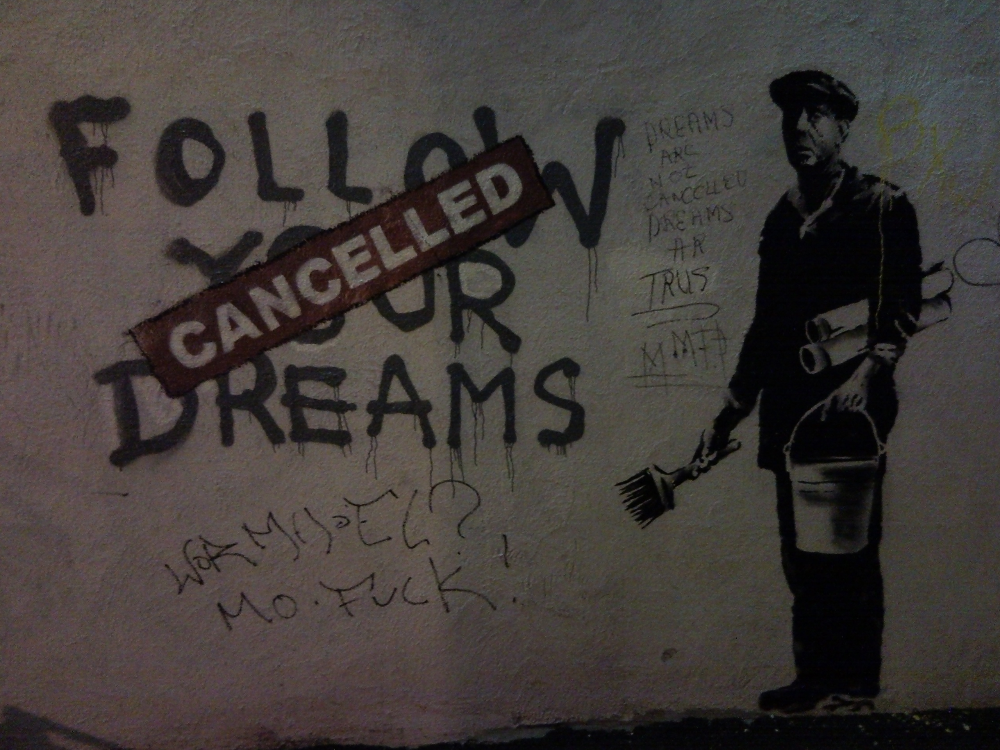
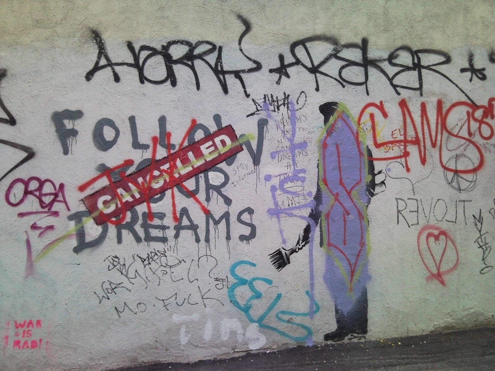
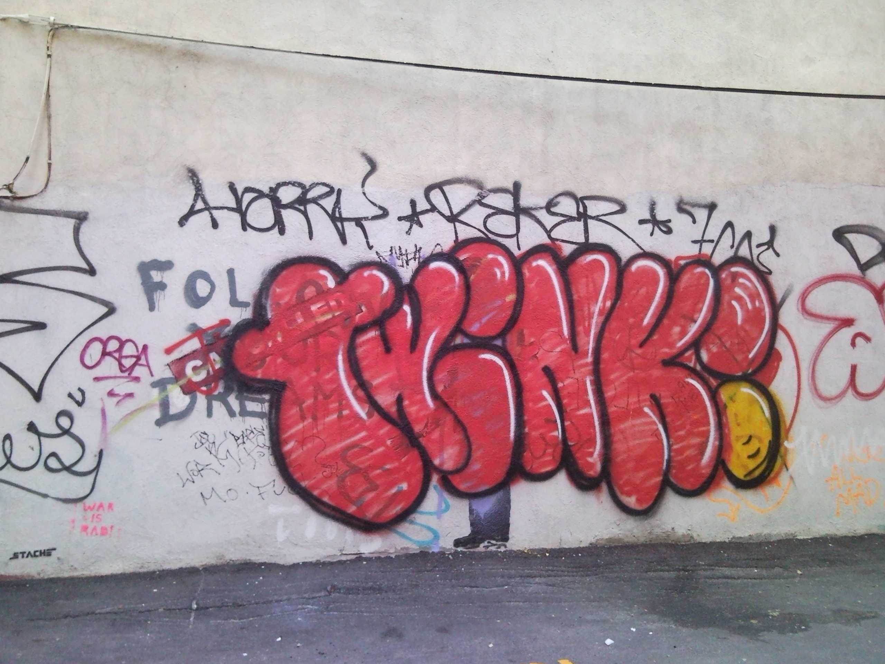
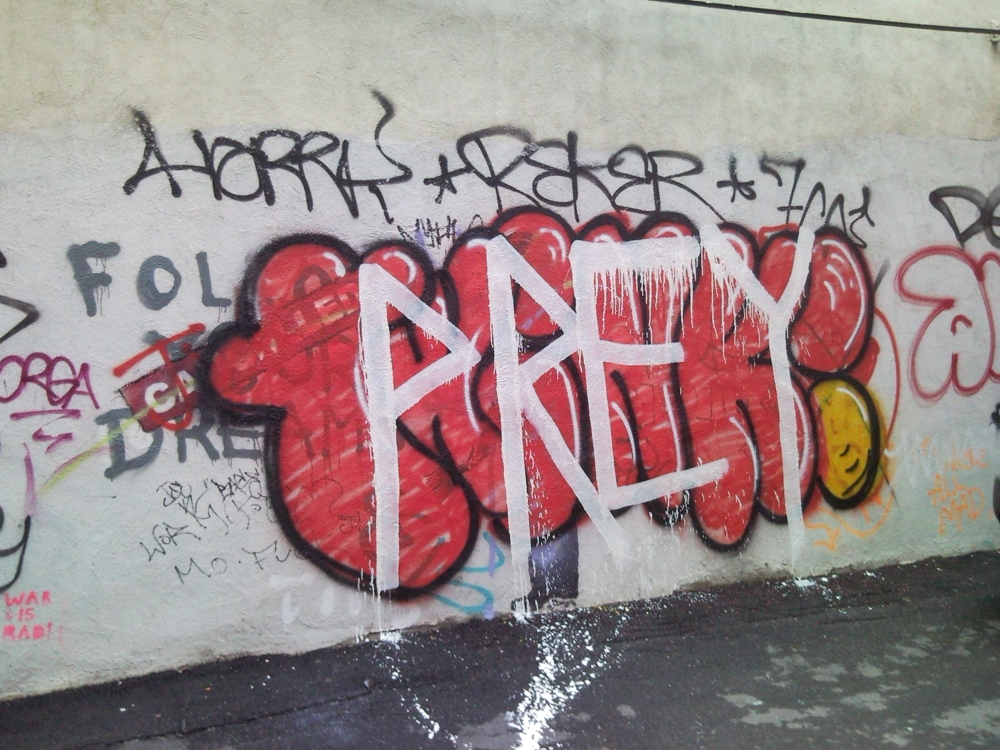

Banksy stencil on the back of Kaze Shabu Shabu in Boston's China Town. Originally this was one of several posts over the course of 2011, but since I'm redoing all this, I might as well combine them all here. 

[{:.lead}](../uploads/SNC00448.jpg)

Unfortunately, other vandals continued to deface this wall and ended up destroying Banksy's work.

[{:.lead}](../uploads/SNC00320.jpg)

There was a third stage of this section of wall I didn't capture. I suppose that's okay because I don't have a picture of what the wall looked like when there was no graffiti either.

[{:.lead}](../uploads/SNC00549.jpg)

[{:.lead}](../uploads/SNC00567.jpg)