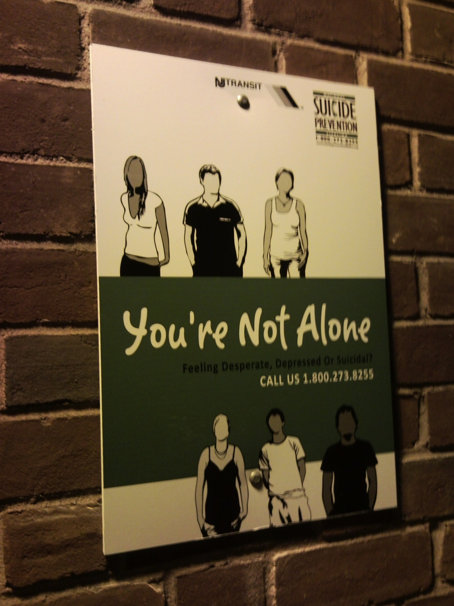

This is how NJ Transit handles jumpers. Must be a bigger problem than one would expect. I've never seen similar signs in major cities, but in the wealthy suburbs of New Jersey, you get signs.

[{:.lead}](../uploads/SNC00258_0.jpg)