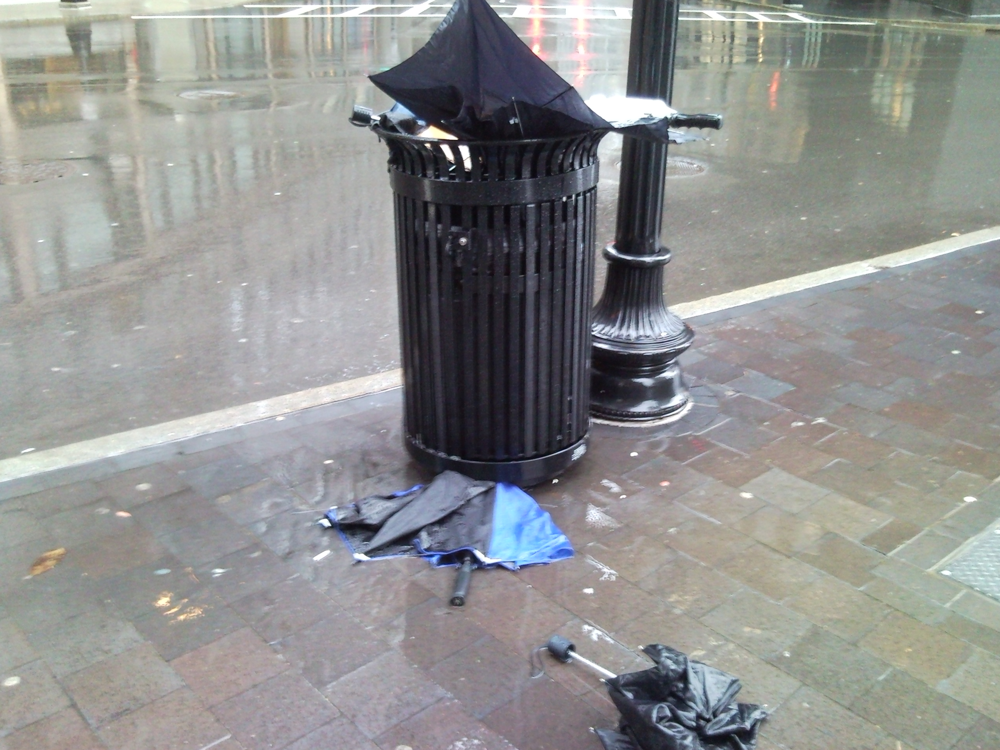

Every trash can on the way to work was filled with broken umbrellas. People think Chicago is windy, but that nick name actually stems from politics (they blow hot air). Not to say that Chicago isn't windy.

Here's an excerpt from one of many sites that can back up this claim:

>"The windiest city in the United States is not the one nicknamed the "Windy City". Among large cities, Chicago ranks twelfth for fastest average wind speed.
>
>America's windiest major city is Boston, where overall the wind blows two miles per hour faster than in Chicago.
>
>Boston and Chicago are two of thirteen large US cities with year-round winds averaging above 10 mph."

[{:.lead}](../uploads/SNC00760.jpg)