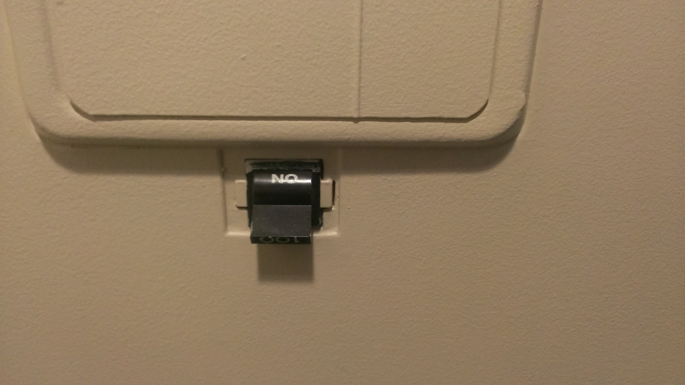
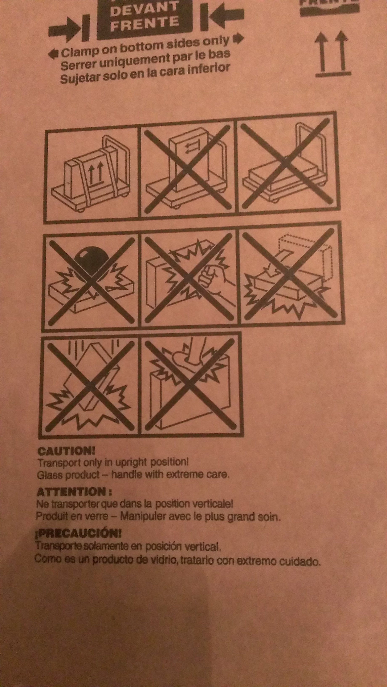

You better not.

Someone installed this switch wrong so that it reads no instead of on. But what I like even more is the instructions from this TV box. Don't even think of laying it flat and then smashing it with a bowling ball. That's the wrong way to use this box. Its contents would be damaged.

[{:.lead}](../uploads/IMAG0877.jpg)
[{:.lead}](../uploads/IMAG0958.jpg)